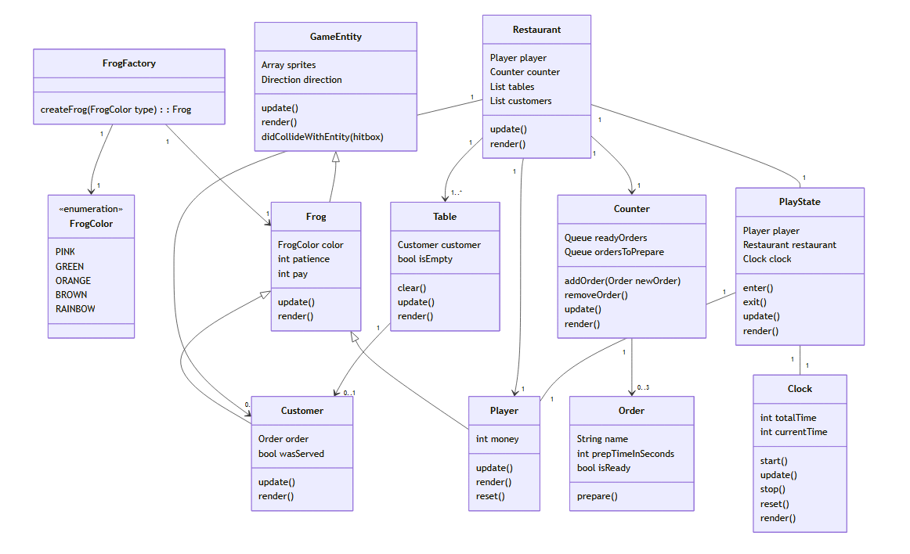

# Final Project

-   [ ] Read the [project requirements](https://vikramsinghmtl.github.io/420-5P6-Game-Programming/project/requirements).
-   [ ] Replace the sample proposal below with the one for your game idea.
-   [ ] Get the proposal greenlit by Vik.
-   [ ] Place any assets in `assets/` and remember to update `src/config.json`.
-   [ ] Decide on a height and width inside `src/globals.js`. The height and width will most likely be determined based on the size of the assets you find.
-   [ ] Start building the individual components of your game, constantly referring to the proposal you wrote to keep yourself on track.
-   [ ] Good luck, you got this!

---

# Sample Proposal - The Leapin' Kitchen

## ✒️ Description

The Leapin' Kitchen is a time-management game where you play as a little frog waiter tasked with serving tables in a busy restaurant. For each table you serve, you'll earn money, and each level has a money goal you must reach before time runs out. You'll race against the clock to ensure every table gets their food before the customers get impatient. You can also decorate your restaurant with the money you earn.

## 🕹️ Gameplay

The player begins the game by selecting a frog they'd like to play as. There are 4 colors available. 

The player starts in Level 1 where he must serve just 1 customer to reach the next level. This is to allow the player to get used to the game mechanics. He must first go to the table to take the customer's order. Then, he must wait for the order to be prepared. After a certain amount of time, the order can be picked up at the counter. Then, he must go back to the table to serve the customer. This is the end of the "tutorial".

In Level 2 and onwards, each table served gives the player a certain amount of money. The player must reach an increasing money goal each level. He must manage his time well, because there is a fixed amount of customers per level, and customers can get impatient and leave the restaurant, which can lead to not reaching the money goal.

When the player reaches the money goal, they can progress to the next level. If they don't reach the money goal, they must try the level again. 

This implementation is a single player experience. The game is played primarily with A, W, S and D to move around, and T for actions like take/pick up/serve order. 

## 📃 Requirements

1. The user shall select which frog color they will use in the game.
3. The user shall take the customers' order.
4. The user shall wait for the order to be completed.
5. The user shall pick up the order on the counter once it's complete.
6. The user shall bring the order to the waiting customer.
8. The user shall reach the money goal to progress to each level.

### 🤖 State Diagram

> [!note]
> Remember that you'll need diagrams for not only game states but entity states as well.

### 🗺️ Class Diagram

### 🧵 Wireframes

-   _Let's Play_ will navigate to the main game.
-   _Upload Cards_ will navigation to the forms for uploading and parsing the data files for the game.
-   _Change Log_ will navigate the user to a page with a list of features/changes that have been implemented throughout the development of the game.

We want to keep the GUI as simple and clear as possible by having cards with relevant images to act as a way for the user to intuitively navigate the game. We want to implement a layout that would look like as if one were playing a match of the Pokémon Trading Card Game with physical cards in real life. Clicking on any of the cards will reveal that card's details to the player.

### 🎨 Assets

We used [app.diagrams.net](https://app.diagrams.net/) to create the wireframes. Wireframes are the equivalent to the skeleton of a web app since they are used to describe the functionality of the product and the users experience.

We plan on following trends already found in other trading card video games, such as Pokémon Trading Card Game Online, Hearthstone, Magic the Gathering Arena, and Gwent.

The GUI will be kept simple and playful, as to make sure the game is easy to understand what each component does and is, as well as light hearted to keep to the Pokémon theme.

#### 🖼️ Images

-   Most images will be used from the well known community driven wikipedia site, [Bulbapedia](https://bulbapedia.bulbagarden.net/wiki/Main_Page).
-   Especially their [Trading Card Game section](<https://bulbapedia.bulbagarden.net/wiki/Full_Art_card_(TCG)>).

#### ✏️ Fonts

For fonts, a simple sans-serif like Roboto will look quite nice. It's a font that is legible, light on storage size, and fun to keep with the theme we're going for. We also used a more cartoonish Pokemon font for the title screen.

-   [Pokemon](https://www.dafont.com/pokemon.font)
-   [Roboto](https://fonts.google.com/specimen/Roboto)

#### 🔊 Sounds

All sounds were taken from [freesound.org](https://freesound.org) for the actions pertaining to cards.

-   [Shuffle cards](https://freesound.org/people/VKProduktion/sounds/217502/)
-   [Flip card](https://freesound.org/people/Splashdust/sounds/84322/)

### 📚 References

-   [Pokemon Rulebook](http://assets.pokemon.com/assets/cms2/pdf/trading-card-game/rulebook/xy8-rulebook-en.pdf)
