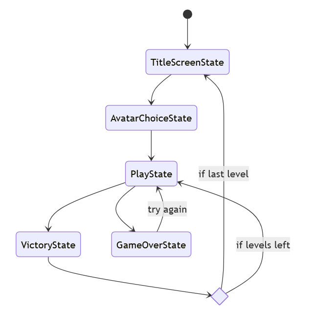
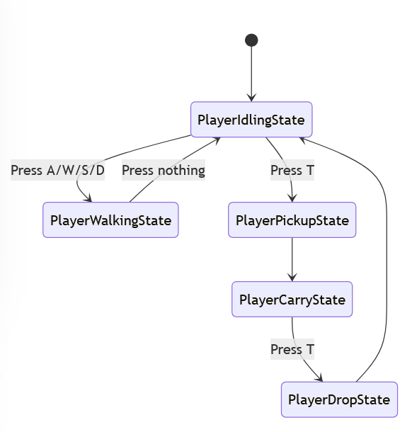
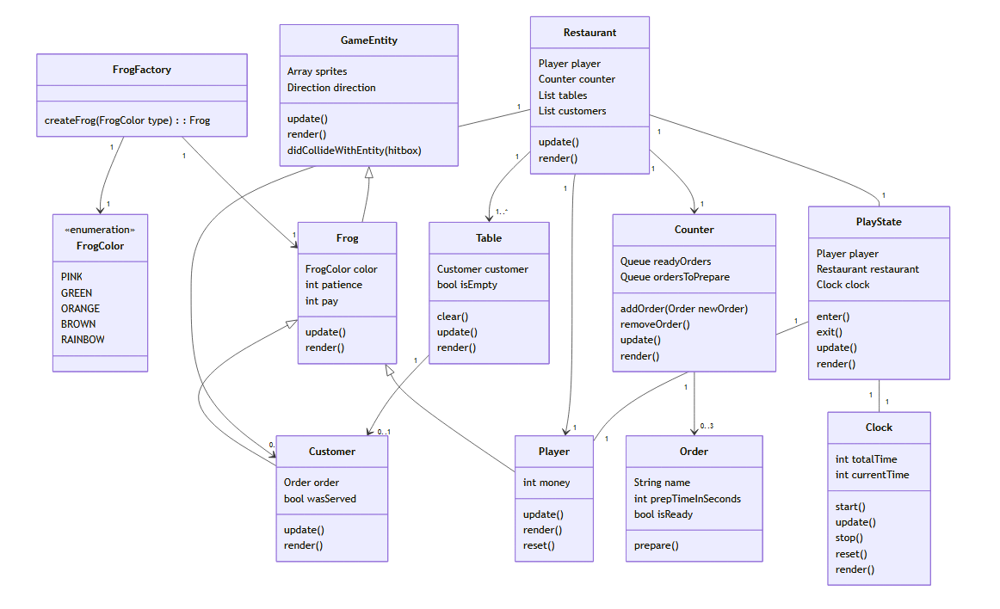
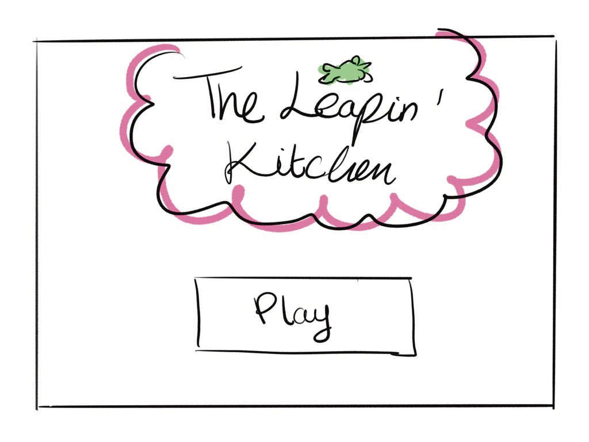
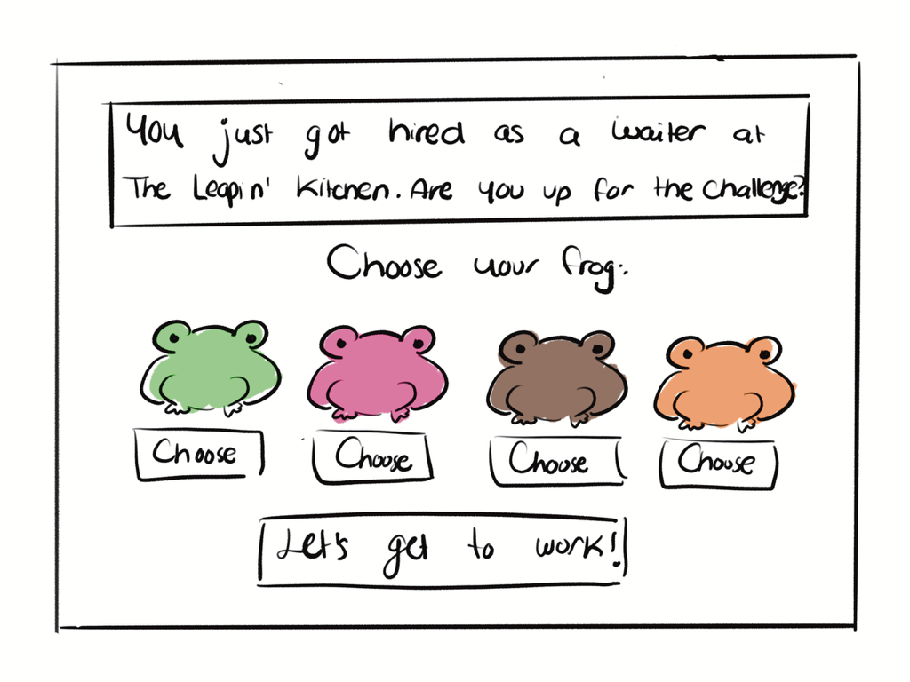
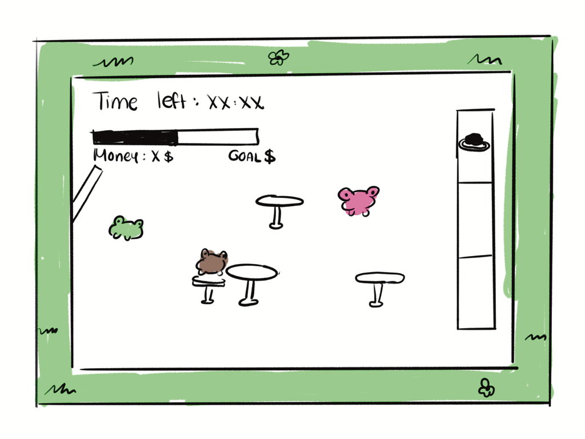

# Final Project

-   [ ] Read the [project requirements](https://vikramsinghmtl.github.io/420-5P6-Game-Programming/project/requirements).
-   [ ] Replace the sample proposal below with the one for your game idea.
-   [ ] Get the proposal greenlit by Vik.
-   [ ] Place any assets in `assets/` and remember to update `src/config.json`.
-   [ ] Decide on a height and width inside `src/globals.js`. The height and width will most likely be determined based on the size of the assets you find.
-   [ ] Start building the individual components of your game, constantly referring to the proposal you wrote to keep yourself on track.
-   [ ] Good luck, you got this!

---

# Sample Proposal - v

## ✒️ Description

The Leapin' Kitchen is a time-management game where you play as a little frog waiter tasked with serving tables in a busy restaurant. For each table you serve, you'll earn money, and each level has a money goal you must reach before time runs out. You'll race against the clock to ensure every table gets their food before the customers get impatient. You can also decorate your restaurant with the money you earn.

## 🕹️ Gameplay

The player begins the game by selecting a frog they'd like to play as. There are 4 colors available. 

The first level is a tutorial. There will be instructions on the screen. The player must serve just 1 customer to reach the next level. This is to allow him to get used to the game mechanics. He must first go to the table to take the customer's order. Then, he must wait for the order to be prepared. After a certain amount of time, the order can be picked up at the counter. Then, he must go back to the table to serve the customer. This is the end of the tutorial.

In Level 2 and onwards, each table served gives the player a certain amount of money. The player must reach an increasing money goal each level. He must manage his time well, because there is a fixed amount of customers per level, and customers can get impatient and leave the restaurant, which can lead to not reaching the money goal.

A little fun feature is the rainbow frog which is rare as it gives the player a very generous tip. However, its patience is very low so the player must hurry to serve it when it appears. 

When the player reaches the money goal, they can progress to the next level. If they don't reach the money goal, they must try the level again. 

This implementation is a single player experience. The game is played primarily with A, W, S and D to move around, and T for actions like take/pick up/serve order. 

## 📃 Requirements

1. The user shall select which frog color they will use in the game.
3. The user shall take the customers' order.
4. The user shall wait for the order to be completed.
5. The user shall pick up the order on the counter once it's complete.
6. The user shall bring the order to the waiting customer.
8. The user shall reach the money goal to progress to each level.

### 🤖 States Diagrams

### 🗺️ Class Diagram

### 🧵 Wireframes

-   _Play_ will navigate to the avatar choosing screen.

Here, the user can select a frog color. They can use arrow keys to navigate between the colors and click "Let's get to work!" to start playing (will probably change this to be "press enter"). 

This is the main gameplay. The player can walk around and interact with objects such as the tables and the counter. The GUI includes the time left for the level and the money the player has accumulated this far, along with a corresponding progress bar. 

### 🎨 Assets

I used Procreate (https://procreate.com/) on iPad to draw my wireframes. 

The GUI wil be simple with a cute pixelated aesthetic. 

#### 🖼️ Images

-   The frog sprites will come from the [lilfroggy sprite set by Patchwork Pixels](<https://patchworkpx.itch.io/lil-froggy>) 
-   The meal sprites will come from the [Pixel Platter sprite set by Netherzapdos](<https://netherzapdos.itch.io/pixel-platter>)
-   The background and object sprites will come from the [Basic Top-Down Interior sprite set by AxulArt](<https://axulart.itch.io/axularts-basic-top-down-interior>)

#### ✏️ Fonts

For fonts, I chose an easy to read pixel font for general text and a cute handwritten font for titles and such.

-   [Pixel](https://www.dafont.com/light-pixel-7.font)
-   [Cute Cat](https://www.dafont.com/cute-cat.font)

#### 🔊 Sounds

All sounds were taken from [freesound.org](https://freesound.org).

-   [Background Music](https://freesound.org/people/Seth_Makes_Sounds/sounds/701610/)
-   [Cash Collection](https://freesound.org/people/CapsLok/sounds/184438/)
-   [Order Ready](https://freesound.org/people/Breviceps/sounds/447910/)
-    [New Client](https://freesound.org/people/EminYILDIRIM/sounds/540568/)
-   [Time Up](https://freesound.org/people/EagleStealthTeam/sounds/209698/)

### 💡 Ideas of more features (if extra time)
-   Money can be used to purchase decorations for restaurant which increases customer patience
-   Money can be used to purchase additional counters
-   Patience progress bar above frogs

